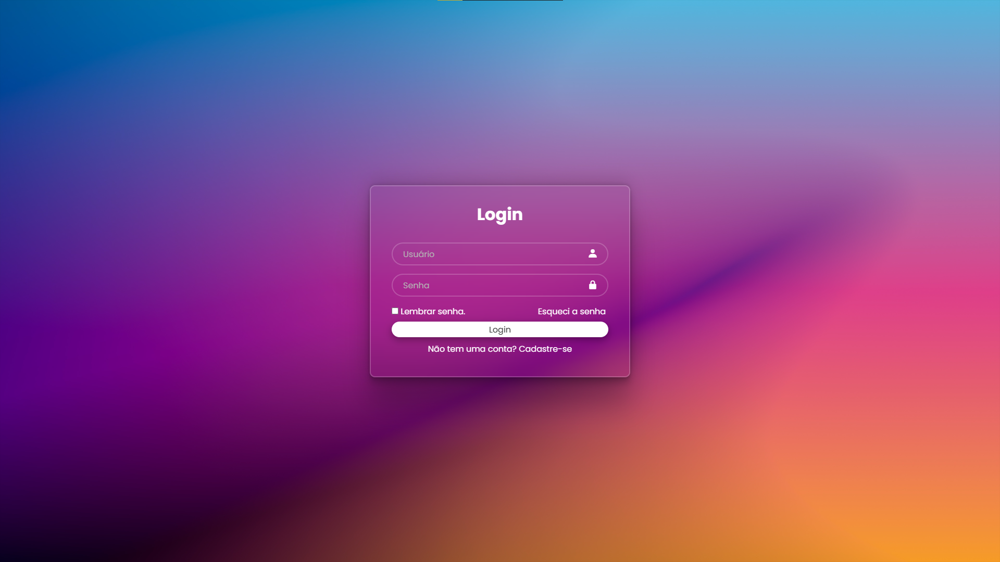

# 🔑 Página de Login

Este é um projeto simples de **página de login** com design moderno e estilização em CSS.  
O site conta com uma tela inicial de autenticação e uma página de boas-vindas ao usuário.  

🔗 **Acesse o site publicado aqui:** [Página de Login](https://davivasconcelos07.github.io/pagina-login/)

---

## 🚀 Tecnologias utilizadas

- **HTML5** – Estruturação do conteúdo  
- **CSS3** – Estilização e responsividade  
- **Boxicons** – Ícones utilizados nos campos de entrada  

---

## 📂 Estrutura do projeto

pagina-login/
 - index.html # Página principal de login
 - boasVindas.html # Página exibida após o login
 - style.css # Estilos e layout da aplicação
 - /img # Imagem de fundo utilizada no projeto

---

## 🎯 Funcionalidades

- Tela de login com campos de **usuário** e **senha**  
- Opção de **lembrar senha** e link de recuperação  
- Botão de login que leva o usuário para a página de boas-vindas  
- Design moderno com **efeito de vidro (glassmorphism)** no formulário  

---

## 📸 Preview

---

✍️ Desenvolvido por **Davi Lucena Vasconcelos**
